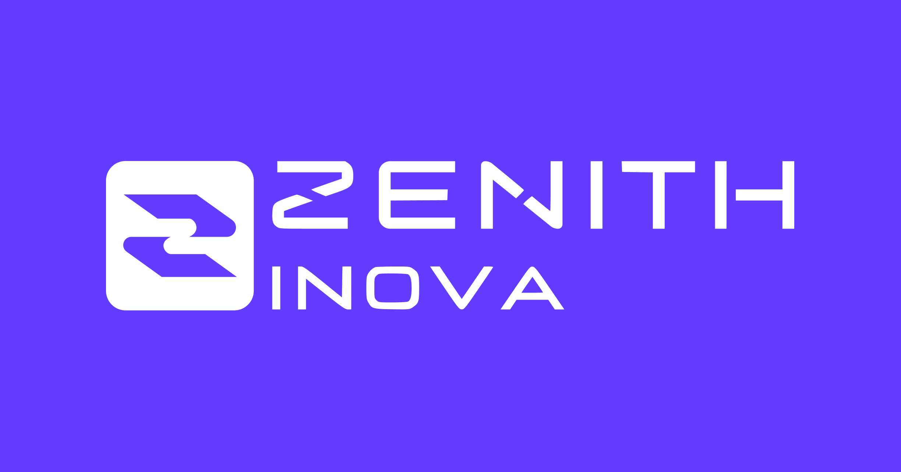

<h1 align="center">
🚀 Zenith Inova - Padrões de Commits e Branches
</h1>

<h1 align="center">
  
</h1>

Seja bem-vindo! Aqui você encontrará padrões e convenções para manter a organização e consistência dos projetos da Zenith Inova, sua utilização é de extrema importância para manter a padronização entre os projetos e garantir o fácil entendimento entre os desenvolvedores.

## Documentação do Repositório

- [Padrão de Commits](./COMMITS_PATTERN.md)
- [Tabela de Emojis para Commits](./COMMITS_EMOJI_TABLE.md)
- [Padrão de Branches](./BRANCHES_PATTERN.md)

Para mais detalhes, consulte cada um dos documentos listados acima.

   
   
   
    

      <h1>Open Source</h1>
      Copyright © 2022 - <a href="https://github.com/iuricode">iuricode</a>
    

     
    
 
      <a href="https://github.com/iuricode/padroes-de-commits/blob/main/LICENSE.md">LICENÇA</a>
    

    💖

